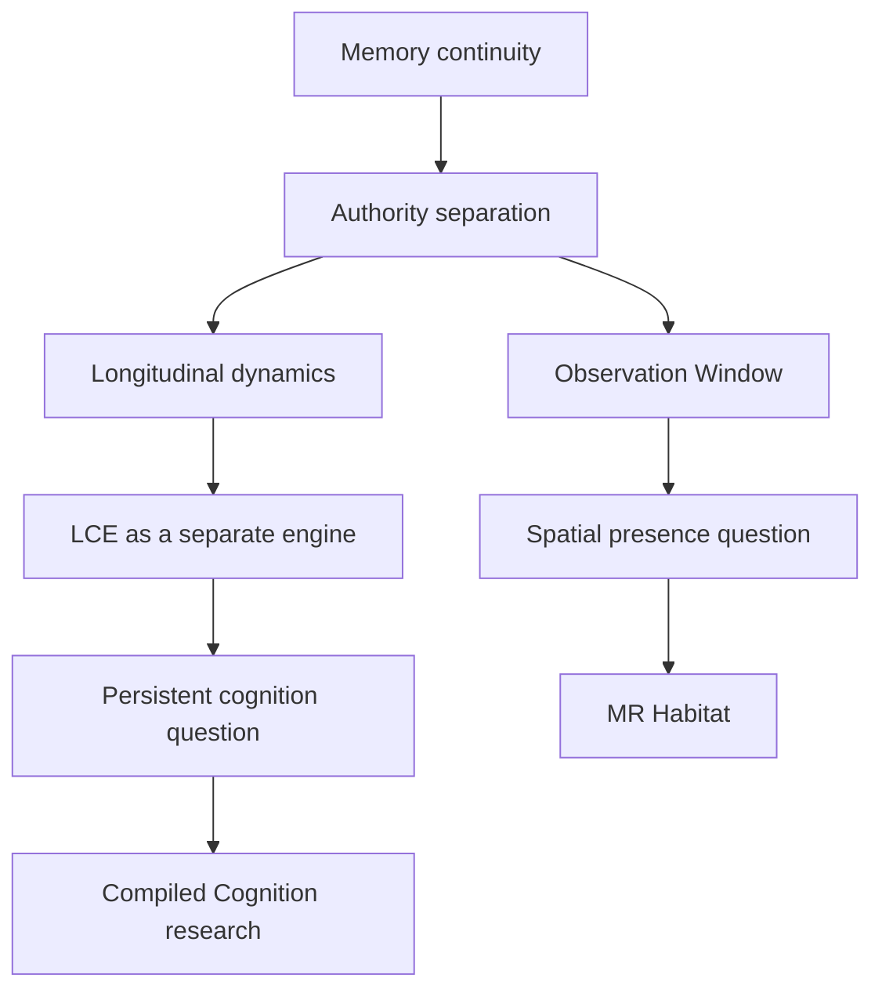

# Building Long-Lived AI Systems

## From Memory Retrieval to Persistent Cognition

The initial question was simple:

> How can an AI agent remember a user across time?

The observed problem was stronger:

> Retrieving history does not guarantee continuity of understanding.

That led to a different question:

> How can previously formed understanding survive turns, restarts, and model
> changes without making the runtime an open-ended reasoning engine?

The resulting system decomposition is:

```text
Mind Runtime  -> runtime authority and continuity
LCE           -> longitudinal structure and cognition compilation research
MR Habitat    -> observable spatial projection
```

The architecture was shaped by reasonable ideas that failed at the boundary,
not by pretending the final shape was obvious from the beginning.

## Architecture Evolution



## 1. Memory Was Not the Real Problem

The first useful model was:

```text
history -> retrieval -> variables -> prompt -> model
```

More provenance, filtering, and retrieval quality improve this loop, but the
model still has to reconstruct the meaning of the past. That leaves repeated
reasoning, model-dependent variance, and ambiguity between a retrieved
candidate and an accepted state.

Mind Runtime therefore treats persistent cognition as runtime state with
explicit identity, provenance, lifecycle, admission, persistence, and failure
semantics. The goal is to continue from authorized state plus new evidence,
not to reconstruct all history on every turn.

`UNKNOWN`, `PARTIAL`, `ROUGH`, and `REVISABLE` remain legitimate states. An
uncertain state is safer than an invented authority.

## 2. Memory, Feeling, Understanding, and Reasoning Are Different Faculties

A large prompt containing memory summaries, affect summaries, and longitudinal
summaries can look like cognition while remaining only prompt fusion. It also
tempts the runtime to take over current-turn planning and response reasoning.

The accepted boundary is:

```text
Memory -> what was experienced
MR     -> what runtime state is authorized now
C10    -> bounded affect change over time
LCE    -> what structure may be learned across time
Body   -> current-turn reasoning, tools, and expression
```

Models remain responsible for inference. MR exposes bounded reusable state; it
does not become an Agent Core.

## 3. LCE Became a Separate Engine

Hot Start began as a product question, but semantic neighbourhoods, region
formation, temporal controls, trajectory, and longitudinal structure quickly
became a different class of problem.

Putting all of that inside MR would make experimental discovery look like
current runtime authority. Keeping it as ad hoc scripts would make each
experiment another unreviewable pipeline.

LCE became an independent, optional, additive engine:

```text
LCE asks: What structure may exist across this history?
MR asks:  What state is authorized to participate in cognition now?
```

MR-side binding exists, but LCE Core remains external and production
activation is a separate decision.

## 4. Hot Start Became a Lab Experiment

A custom Hot Start harness was a reasonable first implementation. It also
created the risk of duplicating the production pipeline: another corpus
loader, another storage root, another model adapter, and another authority
path for every research question.

The correction was to make the lab reusable and run Hot Start as one
experiment on it. Lab products must not mutate production Xiyue state. This
keeps research flexible while keeping MR production conservative.

## 5. Model Variance Changed the Definition of Success

Changing a foundation model can change retrieval initiative, tool use, context
interpretation, and response quality. That qualitative runtime observation did
not imply that MR had failed. It clarified the responsibility boundary.

Success is not making unlike models identical. It is reducing unnecessary
reconstruction, preserving accepted state, narrowing free reinterpretation,
and keeping identity/context boundaries stable.

```text
Model -> inference capability
MR    -> durable state, authority, and continuity
LCE   -> longitudinal learned structure
```

No private dialogue or provider log is needed to make this distinction.

## 6. Retrieval Is Useful, but Retrieval Is Not Authority

Similarity, recency, frequency, and clustering discover candidates. They do
not create canonical state. A dangerous loop is:

```text
retrieve -> interpret -> store -> retrieve again -> treat as evidence
```

The shared rule across MR and LCE is:

> Model output cannot authorize itself.

Evidence, candidate, interpretation, canonical state, and projection are
different objects. Authority is explicit. Ambiguity fails closed.

## 7. From Observation Window to Habitat

Observation Window answered:

> Can the runtime be inspected?

It exposed state, logs, telemetry, binding, and causal trace. Habitat asks a
product question one step later:

> Can a long-running agent's state become perceptible as presence rather than
> only as data?

Habitat is not a virtual-world platform, a cognition store, a primary chat
surface, or a replacement for MR. It is a read-oriented spatial projection of
authored/mock inputs.

```text
Creation side: flexible
Runtime side:  conservative

World package -> validate -> consume -> render
```

Habitat does not build worlds, own cognition, rewrite Memory, or invent
authority.

## The Frozen Boundaries

| Project | Owns | Does not own |
| --- | --- | --- |
| MR | runtime identity, authority, state, admission, persistence, observation | open-ended current-turn reasoning or LCE internals |
| LCE | longitudinal structure research and contract-first consolidation | MR raw memory, vectors, or current response reasoning |
| Habitat | spatial projection and presence experiments | cognition authority, Memory, production writes, or primary chat |

This is the contribution I want the public repositories to make visible: not
the volume of generated code, but the ability to turn ambiguous product and
research questions into testable boundaries, reject superficially workable
abstractions, and keep the resulting systems honest about what they do not yet
know.
